# ☁️❄️ 云阶雪阁 - SaaS 多租户奶茶店管理系统

<div align="center">


一个功能完整的 SaaS 多租户奶茶店管理系统，包含用户端小程序、商家后台管理系统和后端服务。

[](https://spring.io/projects/spring-boot)
[](https://vuejs.org/)
[](https://element-plus.org/)
[](https://baomidou.com/)
[](https://opensource.org/licenses/MIT)

</div>

---

## 📖 目录

- [项目简介](#-项目简介)
- [核心功能](#-核心功能)
- [技术栈](#-技术栈)
- [系统架构](#-系统架构)
- [项目结构](#-项目结构)
- [快速开始](#-快速开始)
- [功能模块](#-功能模块)
- [多租户架构](#-多租户架构)
- [API 文档](#-api-文档)
- [截图预览](#-截图预览)
- [开发指南](#-开发指南)
- [部署说明](#-部署说明)
- [常见问题](#-常见问题)
- [更新日志](#-更新日志)
- [贡献指南](#-贡献指南)
- [许可证](#-许可证)

---

## 🎯 项目简介

**云阶雪阁**是一套完整的 SaaS 多租户奶茶店管理系统，采用前后端分离架构，支持多门店、多租户独立运营。系统包含用户端小程序、商家后台管理系统和后端 API 服务，为奶茶店提供从点单、支付、订单管理到收入分析的一站式解决方案。

### ✨ 项目特点

- 🏢 **多租户架构** - 支持多个商家独立运营，数据完全隔离
- 🔐 **安全可靠** - 基于 Sa-Token 的权限认证，BCrypt 密码加密
- 📊 **数据可视化** - ECharts 收入趋势分析，商品销量排行
- 🎨 **现代化 UI** - 采用 Element Plus，界面美观、交互流畅
- 📱 **响应式设计** - 支持多种设备访问
- 🚀 **高性能** - Redis 缓存，MyBatis-Plus 高效 ORM
- 🔧 **易于扩展** - 模块化设计，便于二次开发

---

## 🚀 核心功能

### 用户端（小程序）

- 🏪 **门店选择** - 支持切换不同门店下单
- � **轮播图** - 首页动态轮播，支持多种跳转
- 🍋 **商品浏览** - 分类展示，图文并茂
- 🛒 **购物车** - 本地存储，按门店隔离
- 💳 **在线下单** - 自取/外送，订单确认
- 📝 **订单管理** - 查看订单历史，订单状态追踪
- 📍 **地址管理** - 收货地址增删改查
- 🎟️ **优惠券** - 领取和使用优惠券
- 👤 **会员中心** - 个人信息管理，头像上传

### 商家后台

- 🏢 **租户管理** - 租户 CRUD，状态管理
- 🏪 **门店管理** - 多门店管理，门店信息维护
- 🍵 **商品管理** - 商品增删改查，规格管理
- 📦 **分类管理** - 商品分类维护
- 🎪 **轮播图管理** - 小程序首页轮播图配置，图片上传，跳转设置，排序管理
- 📋 **订单管理** - 订单查询，状态变更，订单详情
- 🛒 **线下点单** - 快速接单，订单处理
- 👥 **员工管理** - 员工信息管理，职位分配
- 🧪 **原料管理** - 库存管理，出入库记录
- 🎫 **优惠券管理** - 优惠券创建、发放、统计
- 📊 **收入分析** - 收入趋势图表，销量统计
- 🔐 **权限管理** - 基于角色的访问控制

### 后端服务

- 🔒 **身份认证** - 登录注册，Token 管理
- 🏢 **多租户隔离** - 自动租户数据过滤
- 📡 **RESTful API** - 统一接口规范
- 📖 **接口文档** - Knife4j 在线文档
- 🗄️ **数据库** - MySQL 持久化存储
- 🔥 **缓存** - Redis 会话缓存
- 📝 **日志** - 完整的操作日志

---

## 🛠️ 技术栈

### 后端技术

| 技术 | 版本 | 说明 |
|------|------|------|
| Spring Boot | 3.0.5 | 核心框架 |
| MyBatis-Plus | 3.5.5 | ORM 框架 |
| MySQL | 8.0+ | 关系型数据库 |
| Redis | 6.0+ | 缓存数据库 |
| Sa-Token | 1.37.0 | 权限认证框架 |
| Hutool | 5.8.23 | Java 工具类库 |
| Knife4j | 4.4.0 | API 文档工具 |
| Spring Security | - | 密码加密 |
| Lombok | - | 简化 JavaBean |
| Maven | 3.6+ | 项目管理工具 |

### 前端技术（商家后台）

| 技术 | 版本 | 说明 |
|------|------|------|
| Vue.js | 3.5.24 | 渐进式框架 |
| Element Plus | 2.11.8 | UI 组件库 |
| Vue Router | 4.6.3 | 路由管理 |
| Pinia | 3.0.4 | 状态管理 |
| Axios | 1.13.2 | HTTP 客户端 |
| ECharts | 6.0.0 | 数据可视化 |
| Vite | 7.2.4 | 构建工具 |

### 前端技术（小程序端）

| 技术 | 版本 | 说明 |
|------|------|------|
| uni-app | 3.0+ | 跨平台框架 |
| Vue.js | 3.0+ | 核心框架 |
| Vite | 5.0+ | 构建工具 |

### 开发环境

- **JDK** - 17+
- **Node.js** - 16+
- **MySQL** - 8.0+
- **Redis** - 6.0+
- **IDE** - IntelliJ IDEA / VS Code

---

## 🏗️ 系统架构

```
┌─────────────────────────────────────────────────────────────┐
│                          用户层                              │
│  ┌──────────────┐    ┌──────────────┐    ┌──────────────┐   │
│  │  小程序端    │    │  商家后台     │    │   H5 端      │    │
│  │ (uni-app)    │    │(Vue3+Element)│    │  (待开发)     │   │
│  └──────────────┘    └──────────────┘    └──────────────┘   │
└─────────────────────────────────────────────────────────────┘
                            ▼ HTTP/HTTPS
┌─────────────────────────────────────────────────────────────┐
│                         网关层(待添加)                         │
│                    Nginx / Spring Cloud Gateway             │
└─────────────────────────────────────────────────────────────┘
                            ▼
┌─────────────────────────────────────────────────────────────┐
│                         应用层                               │
│  ┌──────────────────────────────────────────────────────┐   │
│  │            Spring Boot 应用服务                      │   │
│  │  ┌─────────┐ ┌─────────┐ ┌─────────┐ ┌─────────┐     │   │
│  │  │租户管理 │ │商品管理  │  │订单管理 │ │用户管理 │     │  │
│  │  └─────────┘ └─────────┘ └─────────┘ └─────────┘     │   │
│  │  ┌─────────┐ ┌─────────┐ ┌─────────┐ ┌─────────┐     │   │
│  │  │员工管理 │ │原料管理  │ │收入分析 │ │优惠券    │     │  │
│  │  └─────────┘ └─────────┘ └─────────┘ └─────────┘     │   │
│  └──────────────────────────────────────────────────────┘   │
│                                                             │
│  ┌──────────────────────────────────────────────────────┐   │
│  │                 通用组件                              │   │
│  │  ┌──────────┐ ┌──────────┐ ┌──────────┐              │   │
│  │  │租户拦截器 │ │权限认证  │ │异常处理   │              │   │
│  │  └──────────┘ └──────────┘ └──────────┘              │   │
│  └──────────────────────────────────────────────────────┘   │
└─────────────────────────────────────────────────────────────┘
                            ▼
┌─────────────────────────────────────────────────────────────┐
│                         数据层                               │
│  ┌──────────────┐              ┌──────────────┐             │
│  │    MySQL     │              │    Redis     │             │
│  │  持久化存储   │              │  会话/缓存   │             │
│  └──────────────┘              └──────────────┘             │
└─────────────────────────────────────────────────────────────┘
```

---

## 📁 项目结构

```
Cloud_Snow_Pavilion/
├── Server/                          # 后端服务
│   ├── src/
│   │   └── main/
│   │       ├── java/
│   │       │   └── com/linlee/cloudsnow/
│   │       │       ├── CloudSnowPavilionApplication.java  # 启动类
│   │       │       ├── common/                            # 公共模块
│   │       │       │   ├── config/                        # 配置类
│   │       │       │   │   ├── MybatisPlusConfig.java    # MyBatis-Plus配置
│   │       │       │   │   ├── SaTokenConfig.java        # Sa-Token配置
│   │       │       │   │   ├── RedisConfig.java          # Redis配置
│   │       │       │   │   └── WebMvcConfig.java         # Web配置
│   │       │       │   ├── context/                       # 上下文
│   │       │       │   │   └── TenantContext.java        # 租户上下文
│   │       │       │   ├── filter/                        # 过滤器
│   │       │       │   │   └── TenantFilter.java         # 租户过滤器
│   │       │       │   ├── interceptor/                   # 拦截器
│   │       │       │   │   └── AuthInterceptor.java      # 认证拦截器
│   │       │       │   ├── exception/                     # 异常处理
│   │       │       │   │   └── GlobalExceptionHandler.java
│   │       │       │   └── result/                        # 统一响应
│   │       │       │       └── Result.java
│   │       │       └── module/                            # 业务模块
│   │       │           ├── analysis/                      # 收入分析
│   │       │           ├── auth/                          # 认证模块
│   │       │           ├── coupon/                        # 优惠券
│   │       │           ├── ingredient/                    # 原料管理
│   │       │           ├── offline/                       # 线下点单
│   │       │           ├── order/                         # 订单管理
│   │       │           ├── product/                       # 商品管理
│   │       │           ├── staff/                         # 员工管理
│   │       │           ├── store/                         # 门店管理
│   │       │           ├── tenant/                        # 租户管理
│   │       │           └── user/                          # 用户管理
│   │       └── resources/
│   │           ├── application.yml                        # 主配置
│   │           ├── application-dev.yml                    # 开发环境
│   │           └── application-prod.yml                   # 生产环境
│   └── pom.xml                                            # Maven配置
│
├── web_front/                       # 前端项目
│   └── admin/                       # 商家后台
│       ├── src/
│       │   ├── assets/              # 静态资源
│       │   ├── components/          # 公共组件
│       │   ├── router/              # 路由配置
│       │   ├── utils/               # 工具函数
│       │   │   └── request.js       # Axios封装
│       │   ├── views/               # 页面组件
│       │   │   ├── Layout.vue       # 主布局(支持侧边栏折叠)
│       │   │   ├── Login.vue        # 登录/注册页
│       │   │   ├── Dashboard.vue    # 首页
│       │   │   ├── Store.vue        # 门店管理
│       │   │   ├── Product.vue      # 商品管理
│       │   │   ├── Category.vue     # 分类管理
│       │   │   ├── Carousel.vue     # 轮播图管理
│       │   │   ├── Order.vue        # 订单管理
│       │   │   ├── Staff.vue        # 员工管理
│       │   │   ├── Ingredient.vue   # 原料管理
│       │   │   ├── Coupon.vue       # 优惠券管理
│       │   │   └── Analysis.vue     # 收入分析(ECharts图表)
│       │   ├── App.vue              # 根组件
│       │   └── main.js              # 入口文件
│       ├── package.json             # 依赖配置
│       └── vite.config.js           # Vite配置
│
├── web_uniapp/                      # 小程序端(uni-app)
│   └── miniapp/                     # 小程序源码
│       ├── src/
│       │   ├── api/                 # API接口
│       │   ├── pages/               # 页面组件
│       │   │   ├── index/           # 首页(轮播图)
│       │   │   ├── menu/            # 菜单页
│       │   │   ├── cart/            # 购物车
│       │   │   ├── order/           # 订单相关
│       │   │   ├── address/         # 地址管理
│       │   │   ├── coupon/          # 优惠券
│       │   │   ├── user/            # 用户中心
│       │   │   ├── login/           # 登录页
│       │   │   └── product/         # 商品详情
│       │   ├── utils/               # 工具函数
│       │   ├── App.vue              # 应用入口
│       │   ├── main.js              # 主入口
│       │   └── pages.json           # 页面配置
│       ├── package.json
│       └── vite.config.js
│
├── database/                        # 数据库脚本
│   └── init.sql                     # 初始化SQL
│
├── upload_img/                      # 上传图片目录
│
└── README.md                        # 项目说明文档(本文件)
```

---

## ⚡ 快速开始

### 环境准备

确保你已安装以下软件：

- **JDK 17+**
- **Maven 3.6+**
- **Node.js 16+**
- **MySQL 8.0+**
- **Redis 6.0+**
- **Git**

### 1. 克隆项目

```bash
git clone https://github.com/yourusername/cloud-snow-pavilion.git
cd cloud-snow-pavilion
```

### 2. 数据库配置

#### 创建数据库

```sql
CREATE DATABASE cloud_snow_pavilion CHARACTER SET utf8mb4 COLLATE utf8mb4_unicode_ci;
```

#### 导入数据

```bash
mysql -u root -p cloud_snow_pavilion < database/init.sql
```

#### 修改配置文件

编辑 `Server/src/main/resources/application-dev.yml`

```yaml
spring:
  datasource:
    url: jdbc:mysql://localhost:3306/cloud_snow_pavilion?useUnicode=true&characterEncoding=utf8&serverTimezone=Asia/Shanghai
    username: root
    password: 你的数据库密码
  
  redis:
    host: localhost
    port: 6379
    password: # Redis密码(如果有)
```

### 3. 启动后端服务

```bash
cd Server
mvn clean install
mvn spring-boot:run
```

后端服务将在 `http://localhost:8080` 启动

API 文档地址：`http://localhost:8080/doc.html`

### 4. 启动前端项目

```bash
cd web_front/admin
npm install
npm run dev
```

前端项目将在 `http://localhost:5173` 启动

### 5. 默认账号

**管理员账号**
- 账号：`admin`
- 密码：`123456`

**测试租户**
- 租户名：测试奶茶店
- 账号：`test`
- 密码：`123456`

---

## 📦 功能模块

### 1. 租户管理

- ✅ 租户列表查询（分页）
- ✅ 新增租户
- ✅ 编辑租户信息
- ✅ 删除租户
- ✅ 租户状态管理（启用/禁用）
- ✅ 租户切换（商家后台）

### 2. 门店管理

- ✅ 门店列表
- ✅ 门店信息维护
- ✅ 门店状态管理
- ✅ 多门店支持

### 3. 商品管理

- ✅ 商品列表（分页、搜索）
- ✅ 商品新增/编辑/删除
- ✅ 商品图片上传
- ✅ 商品规格（SKU）管理
- ✅ 商品上下架
- ✅ 商品分类关联

### 4. 分类管理

- ✅ 分类列表
- ✅ 分类 CRUD
- ✅ 分类排序

### 5. 轮播图管理

- ✅ 轮播图列表（分页、搜索）
- ✅ 轮播图新增/编辑/删除
- ✅ 轮播图图片上传
- ✅ 跳转类型设置（不跳转/商品详情/页面路径/外部链接）
- ✅ 轮播图上下架
- ✅ 排序管理（拖拽排序）
- ✅ 小程序端展示

### 6. 订单管理

- ✅ 订单列表（分页、筛选）
- ✅ 订单详情查看
- ✅ 订单状态变更
- ✅ 订单搜索（订单号、用户手机号）
- ✅ 订单统计

### 7. 线下点单

- ✅ 快速接单
- ✅ 订单制作中
- ✅ 订单完成
- ✅ 订单详情弹窗

### 8. 员工管理

- ✅ 员工列表
- ✅ 员工信息维护
- ✅ 职位管理（老板/员工）
- ✅ 员工状态（在职/离职）
- ✅ 员工登录账号管理

### 9. 原料管理

- ✅ 原料列表
- ✅ 原料信息维护
- ✅ 库存管理
- ✅ 入库/出库操作
- ✅ 库存预警（低于最小库存高亮）
- ✅ 库存变动日志

### 10. 优惠券管理

- ✅ 优惠券列表
- ✅ 优惠券创建
- ✅ 优惠券发放
- ✅ 优惠券使用统计

### 11. 地址管理（用户端）

- ✅ 地址列表
- ✅ 地址新增/编辑/删除
- ✅ 设置默认地址
- ✅ 省市区三级联动
- ✅ 订单确认页地址选择

### 12. 收入分析

- ✅ 收入趋势图表（ECharts 折线图）
- ✅ 商品销量排行（ECharts 柱状图）
- ✅ 统计卡片（总收入、订单数、平均客单价）
- ✅ 时间范围筛选（快捷选择：今天、本周、本月、本年）
- ✅ 增长率显示

---

## 🏢 多租户架构

### 核心设计

本系统采用**基于字段的多租户隔离**方案，所有业务表都包含 `tenant_id` 字段，通过 MyBatis-Plus 的 `TenantLineInnerInterceptor` 实现自动过滤。

### 租户隔离流程

```
用户登录 
  ↓
从 Sa-Token 获取 loginId
  ↓
查询 staff 表获取 tenant_id
  ↓
TenantFilter 设置 TenantContext.setTenantId(tenantId)
  ↓
MyBatis-Plus 拦截器读取 TenantContext.getTenantId()
  ↓
自动在 SQL 中添加 WHERE tenant_id = ?
  ↓
请求结束，TenantContext.clear()
```

### 关键代码

#### TenantContext (租户上下文)

```java
public class TenantContext {
    private static final ThreadLocal<Long> tenantIdHolder = new ThreadLocal<>();
    private static final ThreadLocal<Boolean> ignoreHolder = new ThreadLocal<>();

    public static void setTenantId(Long tenantId) {
        tenantIdHolder.set(tenantId);
    }

    public static Long getTenantId() {
        return tenantIdHolder.get();
    }

    public static void setIgnore(Boolean ignore) {
        ignoreHolder.set(ignore);
    }

    public static Boolean getIgnore() {
        return ignoreHolder.get() != null && ignoreHolder.get();
    }

    public static void clear() {
        tenantIdHolder.remove();
        ignoreHolder.remove();
    }
}
```

#### TenantFilter (租户过滤器)

```java
@Component
@WebFilter(urlPatterns = "/api/*")
public class TenantFilter implements Filter {
    
    @Override
    public void doFilter(ServletRequest request, ServletResponse response, FilterChain chain) {
        HttpServletRequest httpRequest = (HttpServletRequest) request;
        
        // 从 Sa-Token 获取登录用户ID
        if (StpUtil.isLogin()) {
            long loginId = StpUtil.getLoginIdAsLong();
            Staff staff = staffService.getById(loginId);
            if (staff != null) {
                TenantContext.setTenantId(staff.getTenantId());
            }
        }
        
        try {
            chain.doFilter(request, response);
        } finally {
            TenantContext.clear();
        }
    }
}
```

#### MyBatis-Plus 配置

```java
@Bean
public MybatisPlusInterceptor mybatisPlusInterceptor() {
    MybatisPlusInterceptor interceptor = new MybatisPlusInterceptor();
    
    // 租户插件（必须在分页插件之前）
    TenantLineInnerInterceptor tenantInterceptor = new TenantLineInnerInterceptor();
    tenantInterceptor.setTenantLineHandler(new TenantLineHandler() {
        @Override
        public Expression getTenantId() {
            Long tenantId = TenantContext.getTenantId();
            return tenantId == null ? new LongValue(-999L) : new LongValue(tenantId);
        }
        
        @Override
        public String getTenantIdColumn() {
            return "tenant_id";
        }
        
        @Override
        public boolean ignoreTable(String tableName) {
            // 忽略租户表本身
            return "tenant".equals(tableName);
        }
    });
    interceptor.addInnerInterceptor(tenantInterceptor);
    
    // 分页插件
    interceptor.addInnerInterceptor(new PaginationInnerInterceptor(DbType.MYSQL));
    
    return interceptor;
}
```

### 租户表设计

所有业务表都包含 `tenant_id` 字段：

```sql
CREATE TABLE `product` (
  `id` BIGINT UNSIGNED NOT NULL AUTO_INCREMENT,
  `tenant_id` BIGINT UNSIGNED NOT NULL COMMENT '租户ID',
  `name` VARCHAR(100) NOT NULL,
  -- 其他字段...
  PRIMARY KEY (`id`),
  KEY `idx_tenant` (`tenant_id`)
) ENGINE=InnoDB DEFAULT CHARSET=utf8mb4;
```

---

## 📖 API 文档

本项目使用 **Knife4j** 生成在线 API 文档。

### 访问地址

启动后端服务后，访问：

```
http://localhost:8080/doc.html
```

### 主要接口模块

| 模块 | 接口路径 | 说明 |
|------|---------|------|
| 认证 | `/api/auth/**` | 登录、注册、退出 |
| 租户 | `/api/tenant/**` | 租户管理 |
| 门店 | `/api/store/**` | 门店管理 |
| 商品 | `/api/product/**` | 商品管理 |
| 分类 | `/api/category/**` | 分类管理 |
| 轮播图 | `/api/carousel/**` | 轮播图管理 |
| 订单 | `/api/order/**` | 订单管理 |
| 地址 | `/api/address/**` | 收货地址管理 |
| 员工 | `/api/staff/**` | 员工管理 |
| 原料 | `/api/ingredient/**` | 原料管理 |
| 优惠券 | `/api/coupon/**` | 优惠券管理 |
| 收入分析 | `/api/analysis/**` | 数据分析 |

---

## 🖼️ 截图预览

### 商家后台 - 登录注册

<div align="center">
  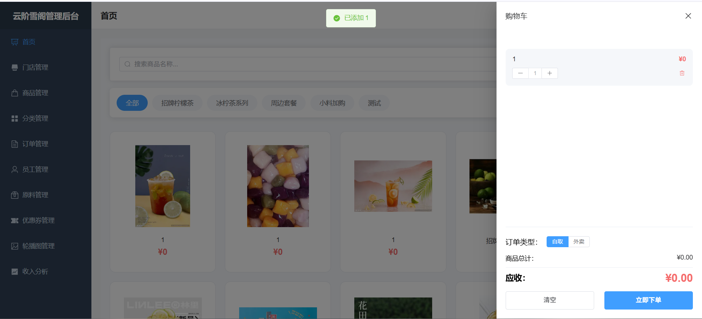
  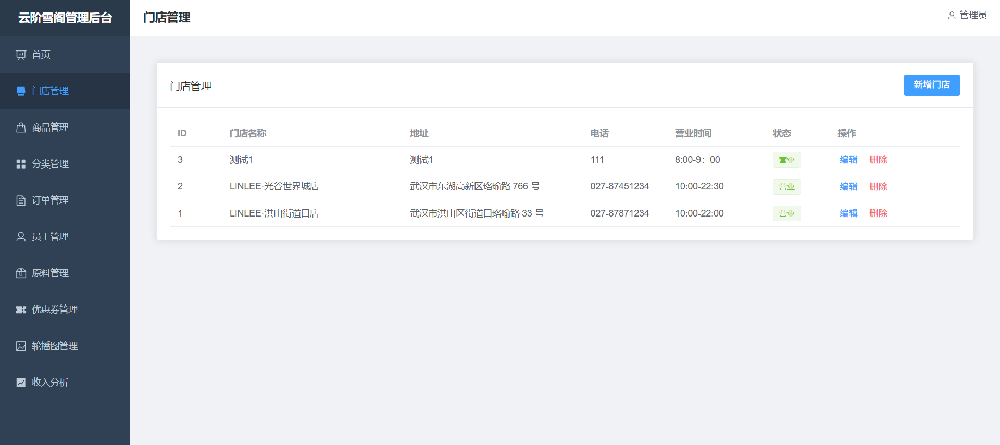
</div>

现代化的登录/注册页面，支持：
- 渐变背景动画
- 毛玻璃卡片效果
- 表单分组（店铺信息、个人信息、账号信息）
- 平滑切换动画

### 商家后台 - 核心功能

<div align="center">
  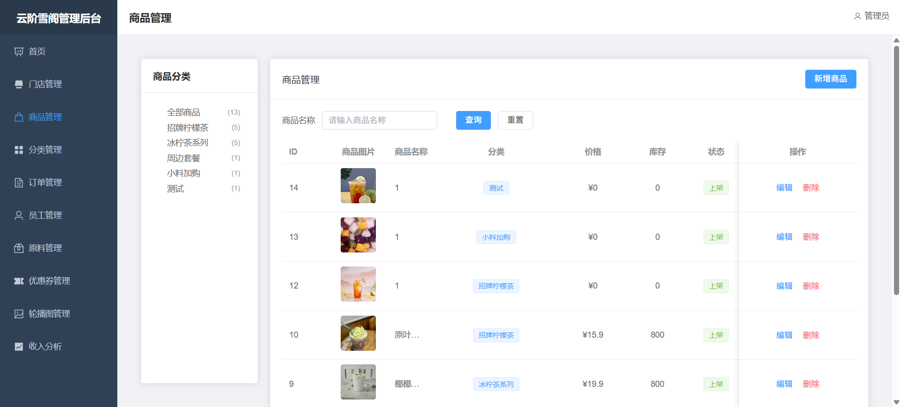
  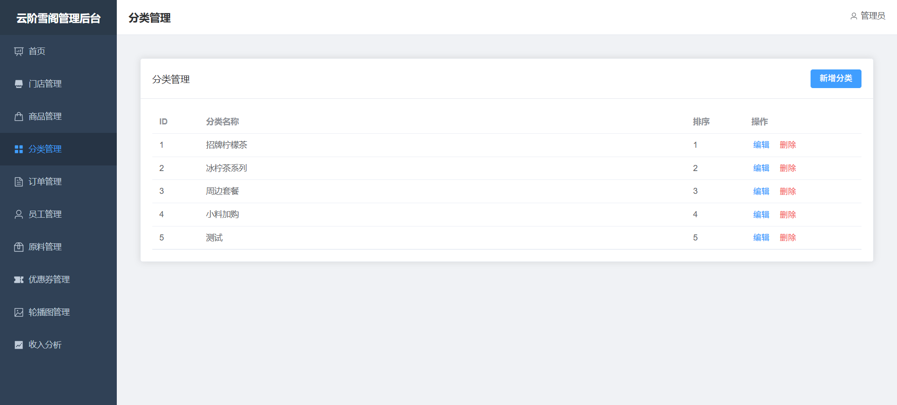
</div>

<div align="center">
  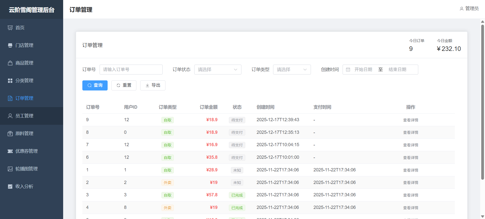
  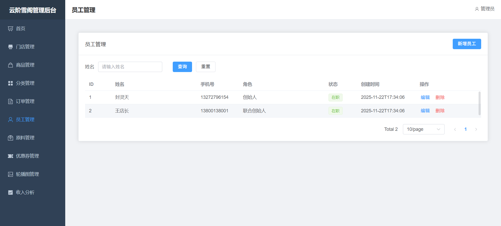
</div>

**功能展示：**
- **商品管理** - 商品列表、规格管理、图片上传
- **订单管理** - 订单列表、状态管理、详情查看
- **轮播图管理** - 小程序首页轮播图配置
- **收入分析** - ECharts 数据可视化图表

### 商家后台 - 其他模块

<div align="center">
  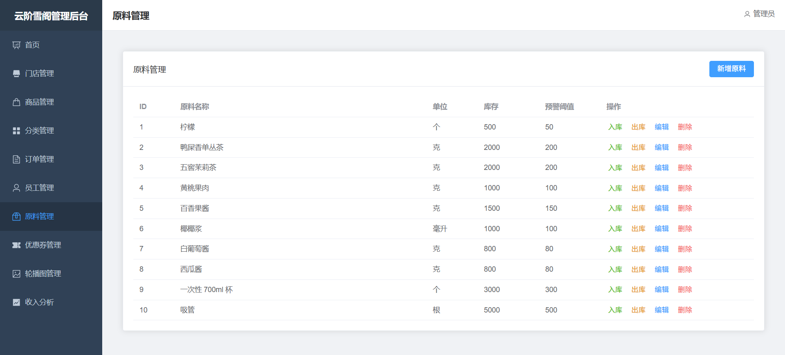
  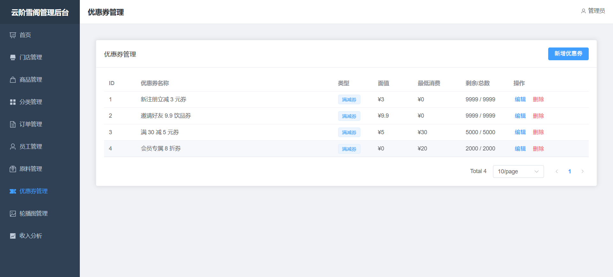
</div>

<div align="center">
  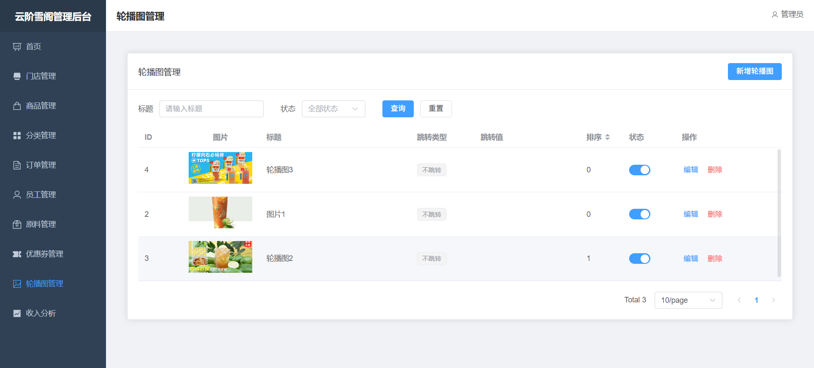
  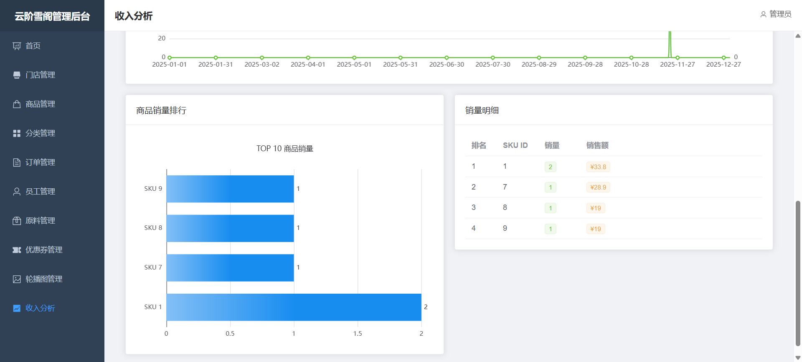
</div>

**管理模块：**
- **门店管理** - 多门店配置与管理
- **员工管理** - 员工信息、权限分配
- **原料管理** - 库存管理、出入库记录
- **优惠券管理** - 优惠券创建、发放、统计

### 小程序端

<div align="center">
  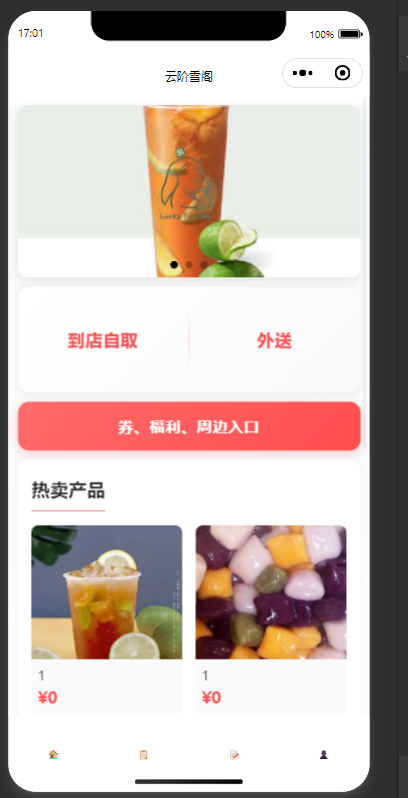
  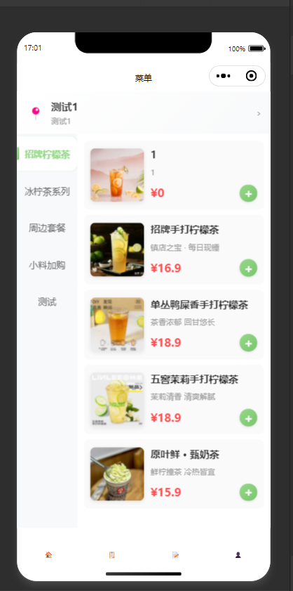
  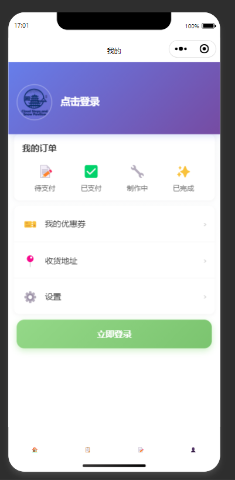
</div>

<div align="center">
  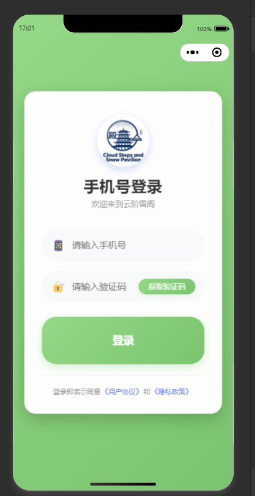
  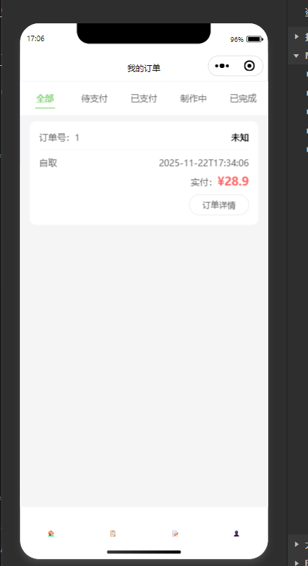
</div>

**小程序功能：**
- **首页** - 轮播图、快捷入口、推荐商品
- **商品菜单** - 分类浏览、商品列表
- **商品详情** - 商品信息、规格选择、加入购物车
- **购物车** - 商品管理、数量调整、结算
- **用户中心** - 个人信息、订单管理、优惠券

---

## 💻 开发指南

### 后端开发

#### 新增业务模块

1. 在 `module` 包下创建模块目录
2. 创建 Entity、Mapper、Service、Controller
3. Entity 必须继承 `BaseEntity` 并包含 `tenant_id` 字段
4. 在 Mapper XML 中编写 SQL

示例：

```java
// Entity
@Data
@TableName("example")
public class Example extends BaseEntity {
    private Long tenantId;
    private String name;
    // 其他字段...
}

// Controller
@RestController
@RequestMapping("/api/example")
public class ExampleController {
    
    @Autowired
    private ExampleService exampleService;
    
    @GetMapping("/list")
    public Result<List<Example>> list() {
        // MyBatis-Plus 会自动添加 tenant_id 过滤
        List<Example> list = exampleService.list();
        return Result.success(list);
    }
}
```

### 前端开发

#### 新增页面

1. 在 `views/` 目录下创建 `.vue` 文件
2. 在 `router/index.js` 中添加路由
3. 在 `Layout.vue` 的菜单中添加入口

示例：

```vue
<template>
  <div class="example-page">
    <el-card>
      <el-table :data="tableData">
        <!-- 表格列定义 -->
      </el-table>
    </el-card>
  </div>
</template>

<script setup>
import { ref, onMounted } from 'vue'
import request from '@/utils/request'

const tableData = ref([])

const loadData = async () => {
  const res = await request.get('/example/list')
  tableData.value = res.data
}

onMounted(() => {
  loadData()
})
</script>
```

### 代码规范

- **后端**
  - 遵循阿里巴巴 Java 开发规范
  - Controller 返回统一 Result 对象
  - Service 处理业务逻辑
  - Mapper 只负责数据库操作

- **前端**
  - 使用 Vue 3 Composition API
  - 组件名使用 PascalCase
  - 方法名使用 camelCase
  - 常量使用 UPPER_CASE

---

## 🚀 部署说明

### 后端部署

#### 1. 打包

```bash
cd Server
mvn clean package -DskipTests
```

生成的 JAR 文件位于 `target/cloud-snow-pavilion-1.0.0.jar`

#### 2. 运行

```bash
java -jar target/cloud-snow-pavilion-1.0.0.jar --spring.profiles.active=prod
```

#### 3. 使用 Systemd（推荐）

创建 `/etc/systemd/system/cloud-snow-pavilion.service`

```ini
[Unit]
Description=Cloud Snow Pavilion Backend Service
After=syslog.target network.target

[Service]
User=www-data
ExecStart=/usr/bin/java -jar /path/to/cloud-snow-pavilion-1.0.0.jar --spring.profiles.active=prod
SuccessExitStatus=143
Restart=always
RestartSec=10

[Install]
WantedBy=multi-user.target
```

启动服务：

```bash
sudo systemctl daemon-reload
sudo systemctl start cloud-snow-pavilion
sudo systemctl enable cloud-snow-pavilion
```

### 前端部署

#### 1. 构建

```bash
cd web_front/admin
npm run build
```

生成的文件在 `dist/` 目录

#### 2. Nginx 配置

```nginx
server {
    listen 80;
    server_name your-domain.com;
    
    root /path/to/dist;
    index index.html;
    
    location / {
        try_files $uri $uri/ /index.html;
    }
    
    location /api/ {
        proxy_pass http://localhost:8080/api/;
        proxy_set_header Host $host;
        proxy_set_header X-Real-IP $remote_addr;
    }
}
```

#### 3. HTTPS 配置（推荐）

使用 Let's Encrypt 申请免费证书：

```bash
sudo certbot --nginx -d your-domain.com
```

---

## ❓ 常见问题

### 1. 数据库连接失败

**问题**：启动后端时提示数据库连接失败

**解决**：
- 检查 MySQL 是否启动：`sudo systemctl status mysql`
- 确认数据库名、用户名、密码是否正确
- 检查 `application-dev.yml` 配置

### 2. Redis 连接失败

**问题**：后端日志显示 Redis 连接异常

**解决**：
- 检查 Redis 是否启动：`sudo systemctl status redis`
- 确认 Redis 密码配置
- 检查端口是否被占用：`netstat -tuln | grep 6379`

### 3. 前端跨域问题

**问题**：前端调用 API 时出现跨域错误

**解决**：
- 后端已配置 CORS，检查 `WebMvcConfig.java`
- 开发环境使用 Vite 代理，检查 `vite.config.js`

### 4. 租户数据隔离失效

**问题**：查询到其他租户的数据

**解决**：
- 检查 `TenantFilter` 是否正确设置 `TenantContext`
- 确认 MyBatis-Plus 租户插件顺序（必须在分页插件之前）
- 查看控制台日志，确认租户 ID 是否正确

### 5. Token 过期问题

**问题**：登录后一段时间自动退出

**解决**：
- 修改 Sa-Token 配置中的 `timeout` 参数
- 检查 Redis 是否正常运行

---

## 📝 更新日志

### v1.1.0 (2025-12-17)

#### 新功能
- ✅ 完成轮播图管理功能（后台管理+小程序展示）
- ✅ 完成地址管理功能（小程序端）
- ✅ 完成小程序端核心功能开发
- ✅ 完成购物车本地存储
- ✅ 完成订单确认和创建流程
- ✅ 完成用户头像上传

#### 优化
- ✨ 优化多租户配置，轮播图等公共数据无需租户过滤
- ✨ 优化图片上传，统一返回相对路径
- ✨ 优化静态资源访问配置
- ✨ 优化小程序端图片URL构建逻辑
- ✨ 优化MyBatis-Plus自动填充配置

#### 修复
- 🐛 修复轮播图在小程序端显示问题
- 🐛 修复update_time字段自动填充失败
- 🐛 修复图片访问404问题
- 🐛 修复轮播图接口401认证问题

### v1.0.0 (2025-11-22)

#### 新功能
- ✅ 完成多租户架构设计和实现
- ✅ 完成商家后台所有核心功能
- ✅ 完成收入分析页面（ECharts 图表）
- ✅ 完成员工管理模块
- ✅ 完成原料管理模块
- ✅ 完成优惠券管理模块
- ✅ 登录/注册页面美化
- ✅ 侧边栏折叠/展开功能

#### 优化
- ✨ 优化注册表单布局（分组、两栏）
- ✨ 优化表单间距，更紧凑
- ✨ 隐藏滚动条，保留滚动功能
- ✨ 优化登录页面动画效果

---

## 🤝 贡献指南

欢迎贡献代码、提出问题和建议！

### 贡献流程

1. Fork 本项目
2. 创建特性分支 (`git checkout -b feature/AmazingFeature`)
3. 提交更改 (`git commit -m 'Add some AmazingFeature'`)
4. 推送到分支 (`git push origin feature/AmazingFeature`)
5. 提交 Pull Request

### 代码审查标准

- 代码符合项目规范
- 通过所有单元测试
- 添加必要的注释
- 更新相关文档

---

## 📄 许可证

本项目采用 [MIT License](https://opensource.org/licenses/MIT) 许可证。

```
MIT License

Copyright (c) 2025 LINLEE

Permission is hereby granted, free of charge, to any person obtaining a copy
of this software and associated documentation files (the "Software"), to deal
in the Software without restriction, including without limitation the rights
to use, copy, modify, merge, publish, distribute, sublicense, and/or sell
copies of the Software, and to permit persons to whom the Software is
furnished to do so, subject to the following conditions:

The above copyright notice and this permission notice shall be included in all
copies or substantial portions of the Software.

THE SOFTWARE IS PROVIDED "AS IS", WITHOUT WARRANTY OF ANY KIND, EXPRESS OR
IMPLIED, INCLUDING BUT NOT LIMITED TO THE WARRANTIES OF MERCHANTABILITY,
FITNESS FOR A PARTICULAR PURPOSE AND NONINFRINGEMENT. IN NO EVENT SHALL THE
AUTHORS OR COPYRIGHT HOLDERS BE LIABLE FOR ANY CLAIM, DAMAGES OR OTHER
LIABILITY, WHETHER IN AN ACTION OF CONTRACT, TORT OR OTHERWISE, ARISING FROM,
OUT OF OR IN CONNECTION WITH THE SOFTWARE OR THE USE OR OTHER DEALINGS IN THE
SOFTWARE.
```

---

## 📧 联系方式

- **项目作者**：LINLEE Team
- **邮箱**：3273495516@qq.com & eighteenthstuai@gmail.com
- **GitHub**：https://github.com/eighteenth-last/Cloud_Snow_Pavilion.git
- **技术支持**：提交 Issue 或发送邮件

---

## 🙏 鸣谢

感谢以下开源项目：

- [Spring Boot](https://spring.io/projects/spring-boot)
- [Vue.js](https://vuejs.org/)
- [Element Plus](https://element-plus.org/)
- [MyBatis-Plus](https://baomidou.com/)
- [Sa-Token](https://sa-token.cc/)
- [ECharts](https://echarts.apache.org/)
- [Knife4j](https://doc.xiaominfo.com/)
- [Hutool](https://hutool.cn/)

---

<div align="center">

**⭐ 如果这个项目对你有帮助，请给它一个星标！⭐**

Made with ❤️ by LINLEE Team

</div>
